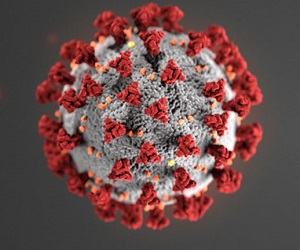

In my software engineering course, we started to learn about the meteor development system. It apparently is a little slower on Windows devices, like the computer I use. My professor told the Windows users in the class to disable their Windows Defender firewall, as it interferes with meteor and makes run time much longer than it should be. I went ahead and disabled it, but was hesitant at first, for I don't have any other anti-virus installed on my machine. I don't go to any suspicious websites, however my classes require me to scour the internet for information resources and sites that seem friendly may contain hidden malware. I thought to myself, "It's okay. What are the odds me getting a virus?" a risk I should not underestimate, but I did and kept on with my studies. Around this time the Wuhan coronavirus had been spreading from China to parts of Europe, making it widespread enough to be dubbed the novel coronavirus, COVID-19. Seeing increasingly more countries become infected had me concerned about contracting it and I thought the same thing to myself, until I got on a plane.

The first confirmed case in Hawaii appeared a week prior to UH Manoa's Spring break, and with my flight booked to return home to Maui, I was a little weary of what I may be exposed to and potentially exposing my family to. The first thing to greet me when I arrived home was congestion, a runny nose, and some coughing. Needless to say, my family and I were concerned, leading me to self quarantine and contact medical professionals until I was in the clear. By some stroke of luck, my symptoms subsided quickly and my family and I are all healthy. Since any exposure to outside entities could infect us, we started doing things that we'd often neglect due to it seeming meanial, like wiping shopping carts and disinfecting doorknobs. Though these are things we should all do, I thought the chance of getting sick from not doing so seemed negligable, but now I see that isn't the case.

My time at home was mostly spent doing homework and attempting to teach myself material that would otherwise be taught in class. Despite having copious ammounts of time on my hands, I was unable to do understand some topics and needed a little more explanation. Normally, I would see my professor and discuss my problem with them, however due to the situation worsening in the country, this would become impossible unless done electronically. When I had done self-learning in the past, I always found it a little difficult to solely use online resources to understand topics. Even though I knew I struggled with this, I never thought much of it, since I could always see my professors in class for more help. Now that I am unable to do that, I'm forced to tackle this problem that I've ignored in the past and change my learning style, something I should have done when I first noticed it.

There are many challenges that we are currently facing and going forward I feel that we will still see many of them. Like how my challenge with online learning had reared its' head back into my life, the struggles we see today may not be the last time we do so. COVID-19 has shellshocked the world and is now making humans face many difficult problems that we had once undermined and are now suffering for. Despite the many horrible things that have been brought upon us from this virus, I think we should take solace in that it has made us aware of the folly of our ways, making us more able to assess problems in the future.
